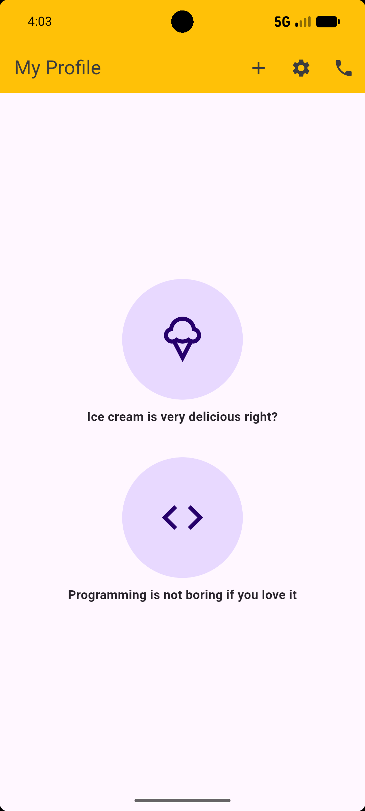

# My Profile — Flutter Assignment (Module 5)

A simple Flutter UI screen built as part of Ostad's Module 5 assignment, demonstrating:
- `Scaffold` and `AppBar` with action icons
- `Column`, `Padding`, `SizedBox`, `Center` for layout
- `CircleAvatar`-style containers with `BoxDecoration` (gradient, border, shadow)
- Custom icons via `Icon` widget

## Preview

## Features

- AppBar titled "My Profile" with add, settings, and phone icons
- Two styled circular icon sections:
  - Ice cream icon — "Ice cream is very delicious right?"
  - Code icon — "Programming is not boring if you love it"

## How to run

\`\`\`
flutter pub get
flutter run
\`\`\`
